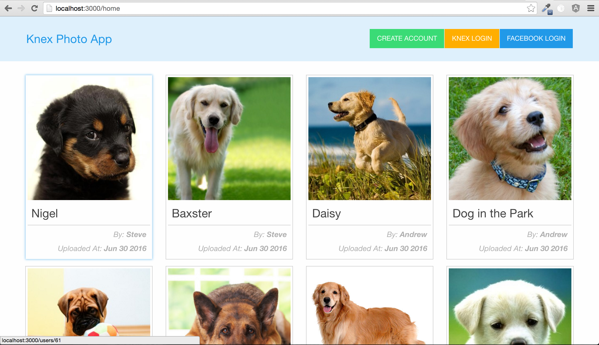

## Knex Photo App

Photo sharing application demonstrating basic authentication and authorization with RESTful routing. The localStrategy branch uses the bcrypt module for password hashing. The oauth branch demonstrates using the passport-facebook strategy, and allows users to login/sign up either with a username/password or with their facebook account.

Technologies/Frameworks: node.js, express.js, knex.js, passport.js, lodash.js, jade, zurb foundations, postgreSQL



# Local Installation
Create a .env file. Inside this file, fill in the following credentials:
```
LOCAL_HOST=http://localhost:3000/
LOCAL_SECRET=*YOUR_SECRET_KEY*
FACEBOOK_CLIENT=*YOUR_FACEBOOK_CLIENT_ID*
FACEBOOK_SECRET=*YOUR_FACEBOOK_SECRET*
CALLBACK_URL=auth/facebook/callback
```

Create database and run the server
```
createdb knex_photos_app
npm install
node app.js
```